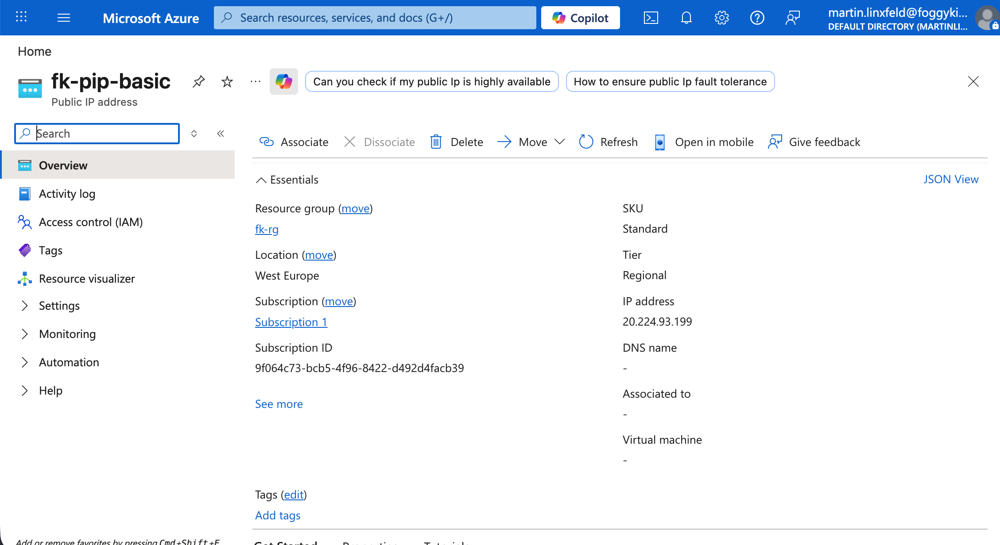

# Example 01: Basic Public IP

In this example, we deploy a single **Azure Public IP** using the `terraform-az-fk-public-ip` module.

This is the simplest starting point for the module and focuses on:

- a standalone Standard Public IP
- optional DNS label support
- clean outputs for IP address and FQDN

## Architecture Overview

This deployment creates:

- A Resource Group
- Public IP (via `terraform-az-fk-public-ip`):
  - `fk-pip-basic`

## Deployment Steps

Initialize and apply the configuration:

```bash
tofu init
tofu plan
tofu apply
```

After deployment, Terraform will output:

- Public IP ID
- Public IP name
- Public IP address
- Public IP FQDN

## Validation

Validate the Public IP and optional DNS label:

```bash
az network public-ip show \
  -g fk-rg \
  -n fk-pip-basic \
  --query "{id:id,ipAddress:ipAddress,fqdn:dnsSettings.fqdn}" \
  -o json
```

Expected result:

- the Public IP resource exists
- `ipAddress` is populated after deployment
- `fqdn` is populated if `domain_name_label` was provided

Actual result from `az network public-ip show` after `tofu apply`:

```json
{
  "fqdn": null,
  "id": "/subscriptions/9f064c73-bcb5-4f96-8422-d492d4facb39/resourceGroups/fk-rg/providers/Microsoft.Network/publicIPAddresses/fk-pip-basic",
  "ipAddress": "20.224.93.199"
}
```

In this run, `fqdn` is `null` because no DNS label was assigned to the deployed Public IP.

## Azure Portal Verification

The same deployment can be verified in Azure Portal. The screenshot below shows:

- Public IP name: `fk-pip-basic`
- Resource group: `fk-rg`
- Location: `West Europe`
- SKU: `Standard`
- Tier: `Regional`
- IP address: `20.224.93.199`
- DNS name: not assigned



## Cleanup

To remove all resources:

```bash
tofu destroy
```

## License

Licensed under the Universal Permissive License (UPL), Version 1.0.

---

© 2026 [FoggyKitchen.com](https://foggykitchen.com) - Cloud. Code. Clarity.
