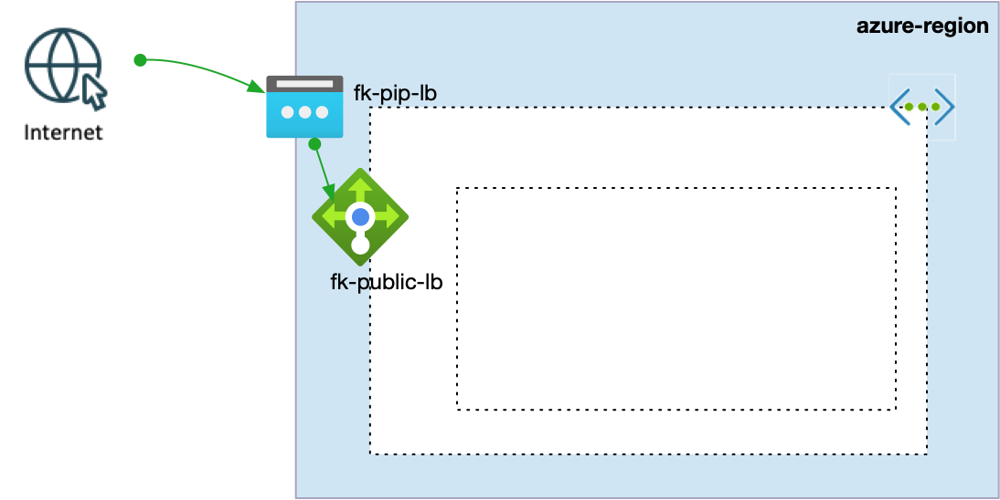
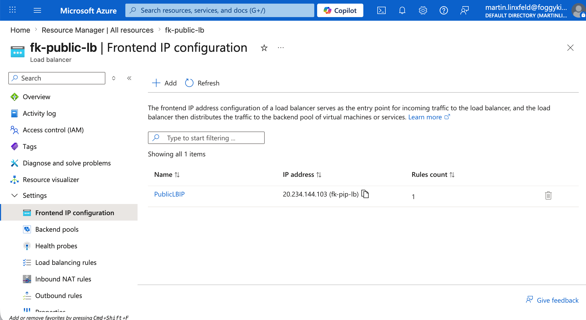

# Example 02: Public IP for Azure Load Balancer

In this example, we use the `terraform-az-fk-public-ip` module to create
an Azure Public IP and then pass its ID into the
`terraform-az-fk-loadbalancer` module.

This example demonstrates a clean integration pattern:

- Public IP ownership remains explicit
- Load Balancer consumes an externally managed Public IP
- the load balancer module stays backward compatible because it can still
  create its own Public IP when `public_ip_id` is not provided

## Architecture Overview

This deployment creates:

- A Resource Group
- Public IP (via `terraform-az-fk-public-ip`):
  - `fk-pip-lb`
- Azure Load Balancer (via `terraform-az-fk-loadbalancer`):
  - `fk-public-lb`

Architecture diagram:



## Deployment Steps

Initialize and apply the configuration:

```bash
tofu init
tofu plan
tofu apply
```

After deployment, Terraform will output:

- Public IP ID and address
- Load Balancer ID
- Frontend IP configuration name

## Validation

Validate that the Load Balancer frontend is using the Public IP created by
the Public IP module:

```bash
az network lb show \
  -g fk-rg \
  -n fk-public-lb \
  --query "{frontendPublicIpIds:frontendIpConfigurations[].publicIPAddress.id,sku:sku.name}" \
  -o json
```

Expected result:

- the Load Balancer exists
- `frontendPublicIpIds` contains the Public IP resource ID created by
  `terraform-az-fk-public-ip`
- `sku` is `Standard`

## Azure Portal Verification

The same deployment can be verified in Azure Portal. The screenshot below
shows the frontend IP configuration of `fk-public-lb` using the Public IP
`fk-pip-lb` with address `20.234.144.103`.



## Notes

This example assumes a GitHub version of `terraform-az-fk-loadbalancer` that
supports the optional `public_ip_id` and `create_public_ip` inputs for
consuming an existing Public IP instead of creating a new one internally.

## Cleanup

To remove all resources:

```bash
tofu destroy
```

## License

Licensed under the Universal Permissive License (UPL), Version 1.0.

---

© 2026 [FoggyKitchen.com](https://foggykitchen.com) - Cloud. Code. Clarity.
